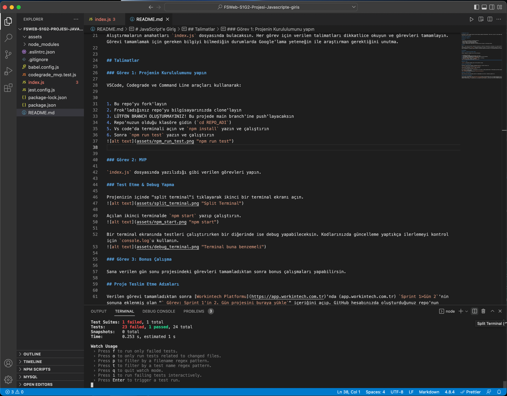
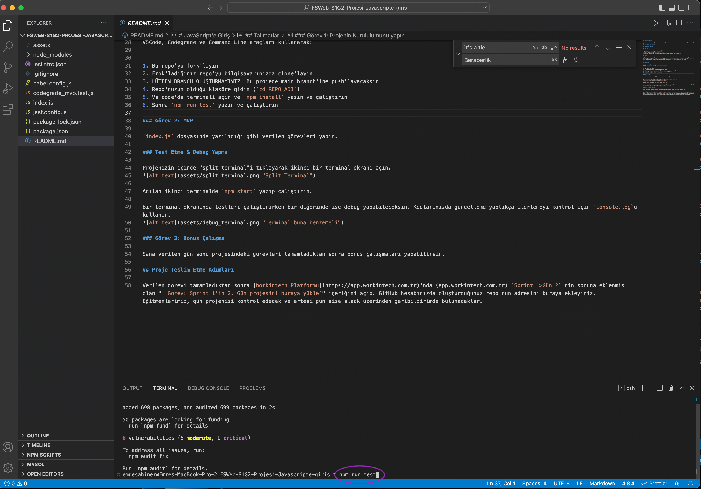
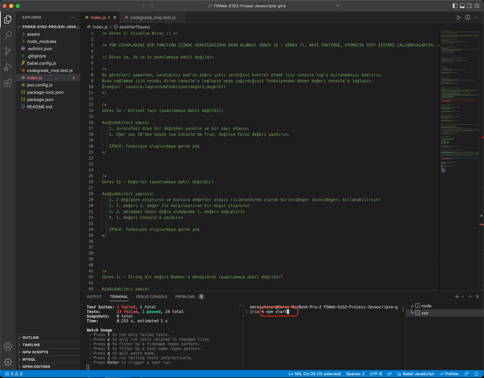
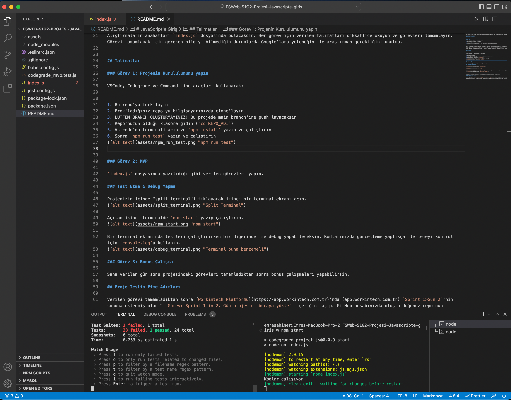
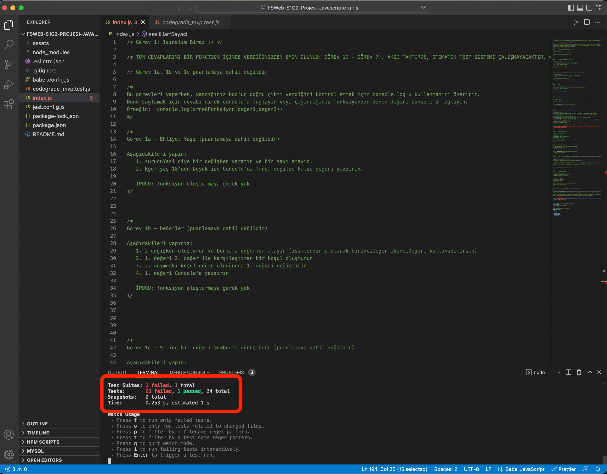

# JavaScript'e Giriş

Bu "sprint 1 - gün 2" projesi görevini kendi başına yapman beklenmektedir. Daha önce eğitmen eşliğinde adım adım yapılan projenin biraz daha genişletilmiş halidir.

## JavaScript Temelleri

- let, const, var kullanın ve farklarını gör.
- farklı operatörleri anla ve kullan.
- basit bir loop / while loop döngüsü yaz.
- if/else ifadeleri kullanarak kontroller yaz.
- function, declarations, expressions ve arrow functions kullan ve farklarını anlat.

## Giriş

Bugün, 7 tane JavaScript görevi tamamlarken JavaScript'in temellerini deneyimleyeceksin. Yavaş yavaş Vanilla JavaScript'e aşina oluyorsun. 🍦

Alıştırmalarının yönergesini `index.js` dosyasında bulacaksın. Her görev için verilen talimatları dikkatlice oku ve görevleri tamamla. Görevi tamamlamak için gereken bilgiyi bilmediğin durumlarda Google'lama 🔍 yeteneğin ile araştırman gerektiğini unutma.

## Talimatlar

### Görev 1: Projenin Kurulumu

VSCode, Codegrade ve Command Line araçları kullanarak:

1. Bu repo'yu fork'la.
2. Fork'ladığın repo'yu bilgisayarında clone'la.
3. Bu projede `main` branch'ine push'layacaksın. LÜTFEN BRANCH OLUŞTURMA!
4. **Repo'nuzun olduğu klasöre gidin** (`cd REPO_ADI`)
5. Vs Code'da terminali açın ve `npm install` yazın ve çalıştırın. Bunu her projede sadece 1 kere yapacaksın.
not: Bugünkü projede pull request **atmıyorsun**. 

### Görev 2: MVP

#### Test Etme & Debug Yapma

Projen klasöründeyken, VS Code'da "split terminal"i tıklayarak ikinci bir terminal ekranı aç.

Sonra `npm run test` yazın ve çalıştırın

Açılan ikinci terminalde `npm start` yazıp çalıştırın.

Split terminal ile ekranında testleri çalıştırırken bir diğerinde ise debug yapabileceksin. Kodlarında güncelleme yaptıkça ilerlemeyi kontrol için `console.log`'u kullanabilirsin.

`index.js` dosyasında ifade edildiği gibi verilen görevleri adım adım yap.
**Amacın 24 testi de geçmek.**

 "npm test skoru örneği (sadece 1 testten geçilmiş(passed)23 test başarısız (_failed_) olmuş

### Görev 3: Bonus Çalışmalar

Sana verilen gün sonu projesindeki görevleri tamamladıktan, yine `index.js` sonundaki bonus çalışmaları yapmanı tavsiye ederiz.

## Proje Teslim Etme Adımları

Verilen görevi tamamladıktan sonra [Workintech Platformu](https://app.workintech.com.tr)'nda (app.workintech.com.tr) `Sprint 1>Gün 2`'nin sonuna eklenmiş olan "` Görev: Sprint 1'in 2. Gün projesini buraya yükle`" içeriğini açıp. GitHub hesabında oluşturduğunuz repo'nun adresini buraya ekleyiniz. Eğitmenlerimiz, gün projenizi kontrol edecek ve ertesi gün size slack üzerinden geribildirimde bulunacaklar.
